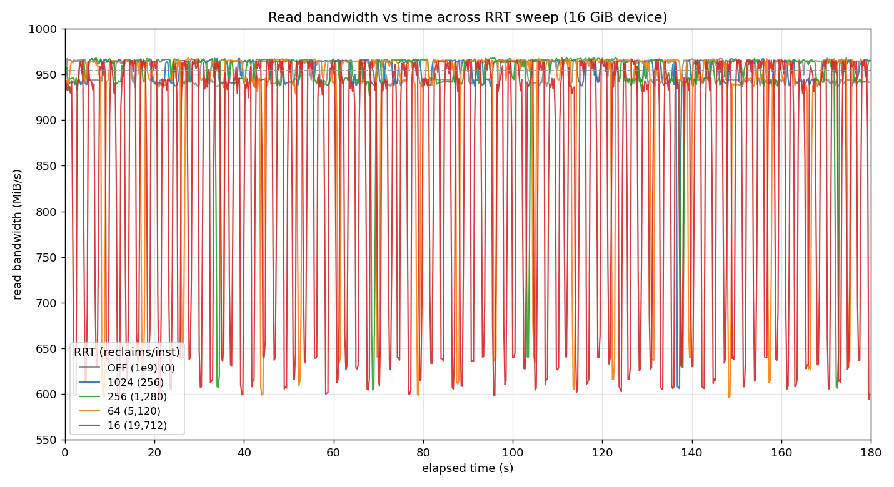
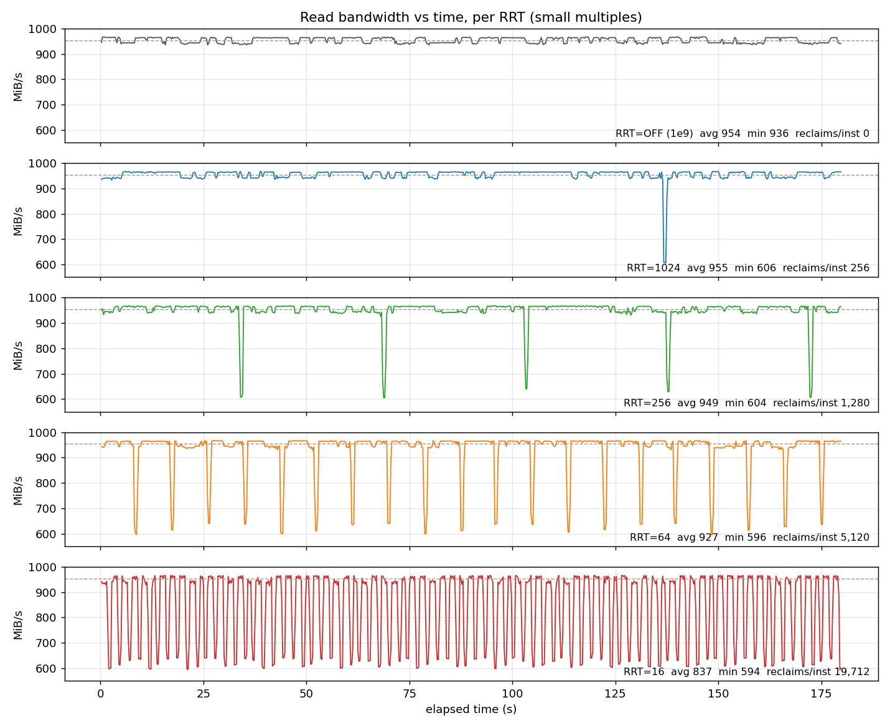
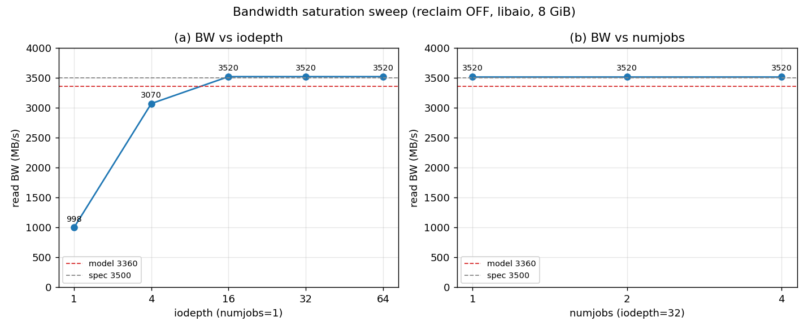

# Report — RRT Read-Bandwidth Time-Series Viz + Bandwidth Sanity Check

**Date:** 2026-06-01 · **Module:** `nvmev_rr` · **Base config:** `SAMSUNG_970PRO` · **Kernel:** 6.8.0-111-generic · **Branch:** `read-reclaim` · **Device:** `/dev/nvme1n1` (16 GiB region `memmap=16G$64G`, pinned by load-order)

> Follow-up to `reports/0601_report_rrt-sweep-16g.md` (the RRT sweep — geometry, per-RRT
> avg/min BW, reclaim counts). This turns those numbers into **time-series figures** and adds a
> **bandwidth sanity check** explaining why the reclaim test reads at ~1 GB/s. The reclaim
> analysis itself lives in 0601 and is not repeated here.

---

## Part 1 — RRT read-bandwidth-vs-time figures

**What was plotted.** Read bandwidth (MiB/s) as a function of elapsed time (0→180 s) for the
reclaim-OFF baseline plus `READ_RECLAIM_THRESHOLD` ∈ {16, 64, 256, 1024}, on the 16 GiB device.
Two figures under `reports/figures/`:

- **`rrt_bw_timeseries_overlay.{svg,png}`** — all five series on one axes, legend labels each by
  RRT and its reclaim count, dashed grey = OFF baseline average.
- **`rrt_bw_timeseries_panels.{svg,png}`** — small multiples, one stacked panel per RRT (shared
  axes), each annotated with avg BW, dip floor, reclaims/inst, and dip-interval count. This is the
  clearest view of the central result.

The y-axis is truncated to 550–1000 MiB/s (clearly labelled) so the reclaim dips are legible.

**Overlay** — all RRT curves + OFF baseline on one axes:

**Small multiples** — one panel per RRT (the clearest view of the central result):

**Data source.** Fresh **fine-grained re-run** at `log_avg_msec=250` (4× finer than 0601's 1 s
logs), everything else identical to 0601 (`RR_SIZE=512m`, `RR_RUNTIME=180`, `set_perf_rr max`,
prep-write before each read loop, device pinned by load-order). 719 samples/series. The finer
resolution resolves each reclaim burst as a clean discrete dip instead of the aliased noise the 1 s
logs produced. New `_250ms` logs sit alongside the 0601 1 s logs (not clobbered):
`rr_results/bw_{baseline_off,rrt16,rrt64,rrt256,rrt1024}_16g_250ms.log`.

Per-RRT stats from the 250 ms re-run (reclaim counts reproduce 0601 exactly):

| RRT | reclaims/inst | avg BW | min(dip) BW | intervals<900 (of 719) |
|----:|---:|---:|---:|---:|
| OFF (1e9) | 0      | 954.3 | 935.5 | 0 (0%) |
| 1024      | 256    | 955.2 | 606.0 | 4 (0.6%) |
| 256       | 1,280  | 949.3 | 604.4 | 20 (2.8%) |
| 64        | 5,120  | 927.0 | 596.0 | 78 (11%) |
| 16        | 19,694 | 836.9 | 594.0 | 300 (42%) |

**How to regenerate:** `python3 plot_rrt_bw.py` (reads the logs in `rr_results/`, auto-prefers the
`_250ms` variants when present, falls back to the 0601 1 s logs otherwise; emits SVG always, PNG if
matplotlib is installed). The generator is committed alongside this report.

**Reading the figures.** Dip *frequency* scales cleanly with `1/RRT` while the dip *floor* does
not: every reclaim burst drops to a common ~595–610 MiB/s regardless of RRT, and lowering RRT
simply makes the bursts more frequent (RRT=1024 → one dip at t≈136 s exactly as the per-pass
arithmetic predicts; RRT=256 → ~5; RRT=64 → ~20 evenly spaced; RRT=16 → a near-continuous
sawtooth). The OFF baseline is flat at ~954 MiB/s with zero dips, confirming the dips are
reclaim-induced. This is the duty-cycle effect quantified in 0601, now visible at a glance.

---

## Part 2 — Bandwidth sanity check (why ~1 GB/s, not ~3.5 GB/s)

**Question.** Every reclaim run reads at ~1000 MB/s (≈964 MiB/s), but the emulated base device is a
Samsung 970 PRO (datasheet ~3500 MB/s). Is the ~1 GB/s a defect?

**Method (separate high-throughput job, reclaim OFF so it can't interfere).** RRT=1e9, reload,
device pinned by load-order, `set_perf_rr max`. Prep-write an **8 GiB** region (spans all 4 FTL
instances; reads must hit written LPNs or conv_ftl skips the NAND sense and reports bogus BW). New
fio job `nvmev-evaluation/fio/workloads/seq-read-bw.fio` (`libaio`, `direct=1`, `bs=128k`,
`rw=read`, `time_based`, `runtime=30`, `group_reporting`), driven by `bw_saturation.sh`. Swept
`iodepth` ∈ {1,4,16,32,64} at `numjobs=1`, then `numjobs` ∈ {2,4} at `iodepth=32` (region tiled
into disjoint slices via `offset_increment` so jobs don't overlap).

| mode | iodepth | numjobs | read BW (MB/s) | read BW (MiB/s) | IOPS |
|---|---:|---:|---:|---:|---:|
| iodepth | 1  | 1 | **998**  | 952  | 7,612 |
| iodepth | 4  | 1 | 3,070    | 2,928 | 23.4k |
| iodepth | 16 | 1 | **3,520** | 3,357 | 26.9k |
| iodepth | 32 | 1 | 3,520    | 3,357 | 26.9k |
| iodepth | 64 | 1 | 3,520    | 3,357 | 26.9k |
| numjobs | 32 | 2 | 3,520    | 3,357 | 26.9k |
| numjobs | 32 | 4 | 3,520    | 3,357 | 26.9k |

*BW vs iodepth (left) and vs numjobs (right), with the 3360 model and 3500 spec reference lines.*
Regenerate: `python3 plot_bw_saturation.py` (reads `rr_results/bw_saturation.csv`).

**Conclusion.**
- **Root cause = QD1, single thread (confirmed).** At `iodepth=1, numjobs=1` the libaio job reads
  **998 MB/s** — the same ~1 GB/s the reclaim test sees. The reclaim workload uses `psync` with no
  `iodepth`/`numjobs`, i.e. exactly one synchronous 128 KiB I/O in flight, so it is latency-bound at
  ≈1 GB/s. **This is the deliberate, correct choice for the reclaim test** (it makes reclaim
  contention show up in the per-second BW) — **not a bug.**
- **Concurrency is the limiter, not latency or NAND.** Bandwidth climbs 998 → 3,070 → 3,520 MB/s as
  iodepth goes 1 → 4 → 16 and then **saturates at ~3,520 MB/s** for iodepth ≥ 16. Adding jobs
  (numjobs 2, 4) gives nothing beyond the iodepth=32 point — the read path is already saturated by
  queue depth alone over the 4-instance/8-channel region.
- **Near-peak settings:** `libaio` + `direct=1` + **`iodepth ≥ 16`** (numjobs=1 suffices) reaches
  **3,520 MB/s ≈ the 970 PRO datasheet 3,500 MB/s**, i.e. ~3.5× the QD1 figure. This sits slightly
  *above* the `PCIE_BANDWIDTH=3360 MB/s` model figure because `set_perf_rr max` drives the latency
  model to ~1 ns and effectively lifts the modelled bandwidth cap, so the achieved throughput tracks
  the datasheet rather than the 3360 ceiling. No `PCIE_BANDWIDTH` edit was needed or made (left
  as-is per scope).

**Bottom line:** the ~1 GB/s reclaim-test number is purely the QD1/psync design choice; the emulated
device reaches its ~3.5 GB/s datasheet read bandwidth with modest concurrency (iodepth ≥ 16).

---

## Artifacts

- Figures: `reports/figures/rrt_bw_timeseries_overlay.{svg,png}`,
  `rrt_bw_timeseries_panels.{svg,png}`, `bw_saturation.{svg,png}`.
- Generators (committed): `plot_rrt_bw.py`, `plot_bw_saturation.py`.
- New fio job: `nvmev-evaluation/fio/workloads/seq-read-bw.fio`. New drivers: `rr_sweep_fine.sh`
  (250 ms sweep), `bw_saturation.sh` (§1B). `rr-seq-read.fio` made `LOG_AVG_MSEC`-overridable
  (default 1000); `rr_run.sh` exports it.
- Logs: `rr_results/bw_*_16g_250ms.log` (fine sweep), `rr_results/bw_saturation.csv` (§1B), plus the
  0601 1 s logs (`rr_results/bw_*_16g.log`) which remain intact.
- **End state:** `READ_RECLAIM_THRESHOLD` restored to **8**; module reloaded and left in a known
  state on `/dev/nvme1n1` (memmap_start=64G, `/proc/nvmev_rr` present).
